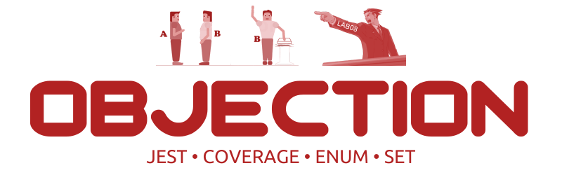

<div align="center">




&nbsp;

&nbsp;

&nbsp;

&nbsp;

&nbsp;

---

</div>

[TOC]

# Due Date

Week 8 **Wednesday** 8:00 pm [Sydney Local Time](https://www.timeanddate.com/worldclock/australia/sydney)

Due date extended for the Easter public holiday.

# Background

## Disclaimer

The information below is greatly simplified for this lab and could be inaccurate. This lab is only on the theme of law, not about law.

You do not need to understand anything about law to complete this lab.

## Rationale

In court, a witness can usually be subjected to two kinds of examinations:

1. Direct-Examination - where the witness is questioned by the party to give evidence in support of the case being made.
1. Cross-Examination - where the witness is questioned by the opposing party to challenge or extend the testimony already given.

As a lawyer, you can make objections. This is a way to protest to the judge against accepting

- a testimony,
- a piece of evidence, or
- a question from the opposing lawyer to your witness

which you consider in violation of court rules.

With a large set of [Objection Items](#objection-items) to cover, our goal is to automate the process while ensuring that all of our code is accounted for when testing.

Now, you can do this by pretending to be a machine and manually stepping through each line of code, potentially adding a few `console.log()` statements under certain branch conditions - to which our reaction would be "surely you jest!", because why do that when you can use the almighty `--coverage`!

## Getting Started

- Copy the SSH clone link from Gitlab and clone this repository on either VLAB or your local machine.
- In your terminal, change your directory (using the `cd` command) into the newly cloned lab.

## Package Installation

1. Open [package.json](package.json) and look at existing packages in `"dependencies"` and `"devDependencies"`. Install them with:
    ```shell
    $ npm install # shortcut: npm i
    ```

1. Under `"scripts"`, add `jest` to your test with the special option `"--coverage"`:
    ```json
    "scripts": {
      "test": "vitest run --coverage",
      "tsc": "tsc --noEmit",
      "tsx": "tsx",
      "lint": "eslint '**/*.ts'"
      // Any other scripts you want
    }
    ```

1. (Optional) Update [.gitlab-ci.yml](.gitlab-ci.yml) with testing and linting.

1. That's it. You're good to go :).

## Interface: Functions

<table>
  <tr>
    <th>Name & Description</th>
    <th>Parameters</th>
    <th>Return Type</th>
    <th>Errors</th>
  </tr>
  <tr>
    <td>
        <code>listObjections</code>
        <br/><br/>
        Analyse the given question and testimony before returning a Set of Objection Items (see further below).
        <br/><br/><b>Difficulty</b>: ⭐⭐
    </td>
    <td>
<pre>
(
  question: string,
  testimony: string,
  examinationType: ExaminationType
)
</pre>
    </td>
    <td>
        <code>Set&lt;Objection&gt;</code>
    </td>
    <td>
        Throw <code>Error</code> when
        <ul>
          <li>The question is an empty string, <code>''</code></li>
          <li>The testimony is an empty string, <code>''</code></li>
        </ul>
    </td>
  </tr>
</table>

## Interface: Data Types

<table>
  <tr>
    <th>Enum</th>
    <th>Members</th>
  </tr>
  <tr>
    <td>
        <code>Objection</code>
    </td>
    <td>
<pre>
ARGUMENTATIVE
COMPOUND
HEARSAY
LEADING
NON_RESPONSIVE
RELEVANCE
SPECULATION
</pre>
    </td>
  </tr>
  <tr>
    <td>
        <code>ExaminationType</code>
    </td>
    <td>
<pre>
CROSS
DIRECT
</pre>
    </td>
  </tr>
</table>

Examples of how JavaScript [Sets](https://developer.mozilla.org/en-US/docs/Web/JavaScript/Reference/Global_Objects/Set) and TypeScript [Enums](https://www.typescriptlang.org/docs/handbook/enums.html) can be used are in the starter code of [src/objection.ts](src/objection.ts), although you are recommended to do further reading.

In this lab, we don't specify the enum types, so you are free to change the default as long as all the members in the table above exist in [src/objection.ts](src/objection.ts).

## Objection Items

The link below contains a list of common objections in a court case:
- https://www.womenslaw.org/laws/preparing-court-yourself/hearing/objecting-evidence

For this lab, we will use a subset of the above with *our* crude criteria for when a question or testimony should be objected to.
You can interpret them as literally as posibble when translating to code.

1. ARGUMENTATIVE
    - Only valid during `CROSS` Examination
        - When a `question` does not end with a question mark (?)
1. COMPOUND
    - When a `question` contains more than one question mark (?)
1. HEARSAY
    - When a `testimony` contains any of the phrases (i.e. includes any of the substrings) below:
        - "heard from"
        - "told me"
1. LEADING
    - Only valid during `DIRECT` Examination, when any of:
        - `question` starts with "why did you" or "do you agree"
        - `question` ends with "right?" or "correct?"
1. NON_RESPONSIVE
    - When the `testimony` does not contain any word from the `question`.
    - NOTE:
        - you may want to first remove all characters that are not letters, numbers or spaces from the `testimony` and `question`
        - For simplicity, you can assume that words are split by white spaces (/\s/) and must have a length of at least 1 character
        - For this critera, words are exact-match, i.e. "hell" and "hello" are not the same.
1. RELEVANCE
    - When the length of the `testimony` is strictly greater than thrice (3x) the length of the `question`.
      - By length, we are referring to the length of the string, i.e. `testimony.length` and `3 * question.length`, rather than the number of words
1. SPECULATION
    - During `DIRECT` examination
        - The `testimony` contains the word "think" (i.e. includes the substring "think")
    - During `CROSS` examination
        - The `question` contains the word "think" (i.e includes the substring "think")

### Note
1. The question and testimony are case-insensitive - in [src/objection.ts](src/objection.ts), we have added the two lines below for you so that both strings can be treated as lowercase:
    ```javascript
    question = question.toLowerCase();
    testimony = testimony.toLowerCase();
    ```
1. Treat white spaces as regular characters. For example, the string
    - `"heard from"` is hearsay, but
    - `"heard   from"` is **not** hearsay.
1. Testimonies and questions can have no objections or multiple objections - this is why the returned type is a Set.
1. Our automarking will assess the general (basic) scenarios for each objection. If you were able to come up with an obscure/ambiguous case such as "should words be matched in non-responsive after punctuations are removed" (i.e. "original" vs "ori$$$ginal"), you can be assured that these won't be assessed.

# Task

## Testing

Same with previous lab exercises, you are to write tests for the functions defined in the [Interface: Functions](#interface-functions). Try to cover as many different cases as you can.

See [objection.test.js](objection.test.js) for an example of how you can test for errors being raised in your functions.

## Implementation

Implement the functions in [Interface: Functions](#interface-functions) and ensure that they pass your tests.

After the command:
```shell
$ npm t
```
a directory named [coverage](coverage) should be generated.

There should be a file called `index.html` (in the path `coverage/index.html`) which you can open in your preferred browser (e.g. Firefox / Google Chrome). This will display further details about which line or branch of code in your implementation is not currently covered by your tests.

Remove redundant code or improve your test suite as necessary to achieve 100% coverage.

# Submission

- Use `git` to `add`, `commit`, and `push` your changes on your master branch.
- Check that your code has been uploaded to your Gitlab repository on this website (you may need to refresh the page).

**If you have pushed your latest changes to master on Gitlab no further action is required! At the due date and time, we automatically collect your work from what's on your master branch on Gitlab.**

Afterwards, assuming you are working on a CSE machine (e.g. via VLAB), we strongly recommend that you remove your `node_modules` directory with the command:
```shell
$ rm -rf node_modules
```
This is because CSE machines only allow each user to have a maximum of 2GB, so you will eventually run out of storage space. It is always possible to `npm install` your packages again!

# Additional Information

## Sample package.json

<details>

<summary>Click to view our sample package.json</summary><br/>

**Note**:
1. The main keys to pay attention to are `"scripts"`, `"dependencies"` and `"devDependencies"`.
1. It is fine if the versions of your packages are newer.

```json
{
  "name": "lab07_objection",
  "version": "1.0.0",
  "description": "",
  "keywords": [],
  "license": "UNLICENSED",
  "author": "",
  "main": "src/objection.ts",
  "scripts": {
    "test": "vitest run --coverage",
    "tsc": "tsc --noEmit",
    "tsx": "tsx",
    "lint": "eslint '**/*.ts'"
  },
  "dependencies": {
    "tsx": "^4.20.5"
  },
  "devDependencies": {
    "@eslint/js": "^10.0.1",
    "@stylistic/eslint-plugin": "^5.10.0",
    "@types/node": "^26.1.1",
    "@typescript-eslint/eslint-plugin": "^8.62.0",
    "@vitest/coverage-v8": "^4.1.10",
    "eslint": "^10.6.0",
    "globals": "^17.7.0",
    "tsx": "^4.22.4",
    "typescript": "^6.0.3",
    "typescript-eslint": "^8.62.0",
    "vitest": "^4.1.9"
  }
}
```

</details>
