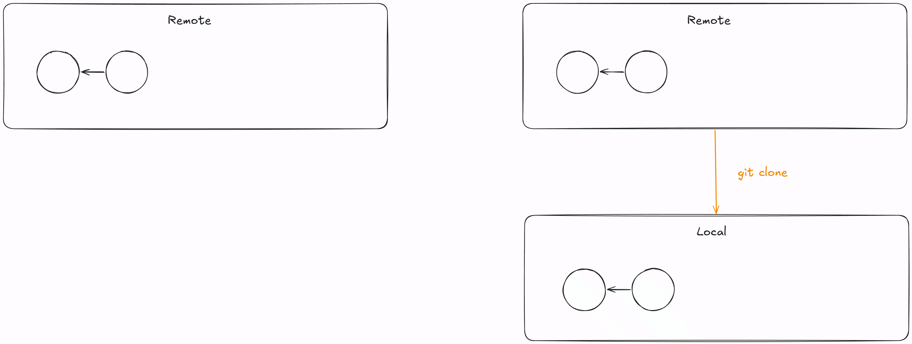
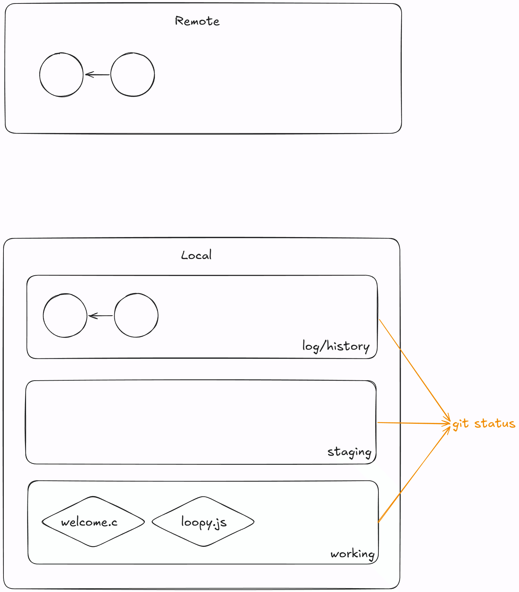
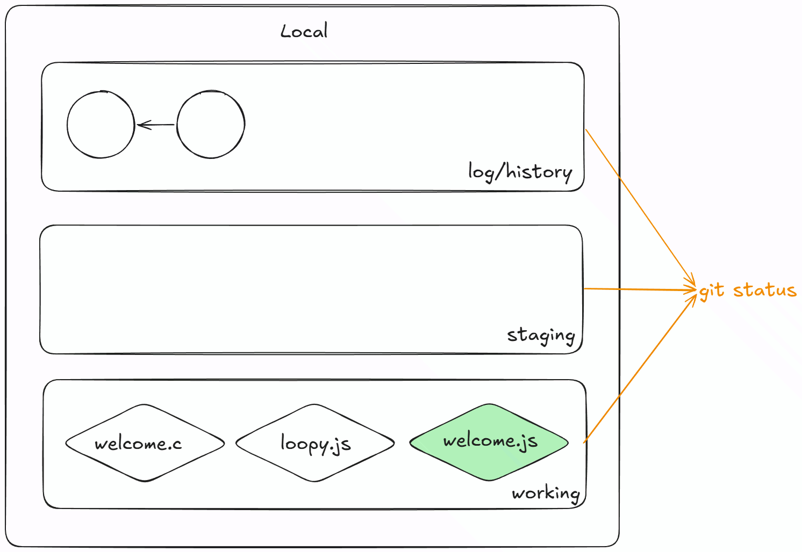
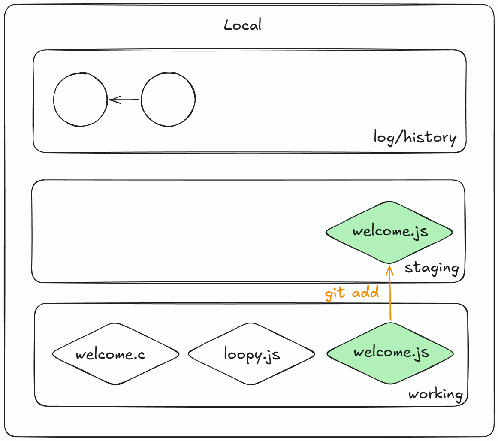
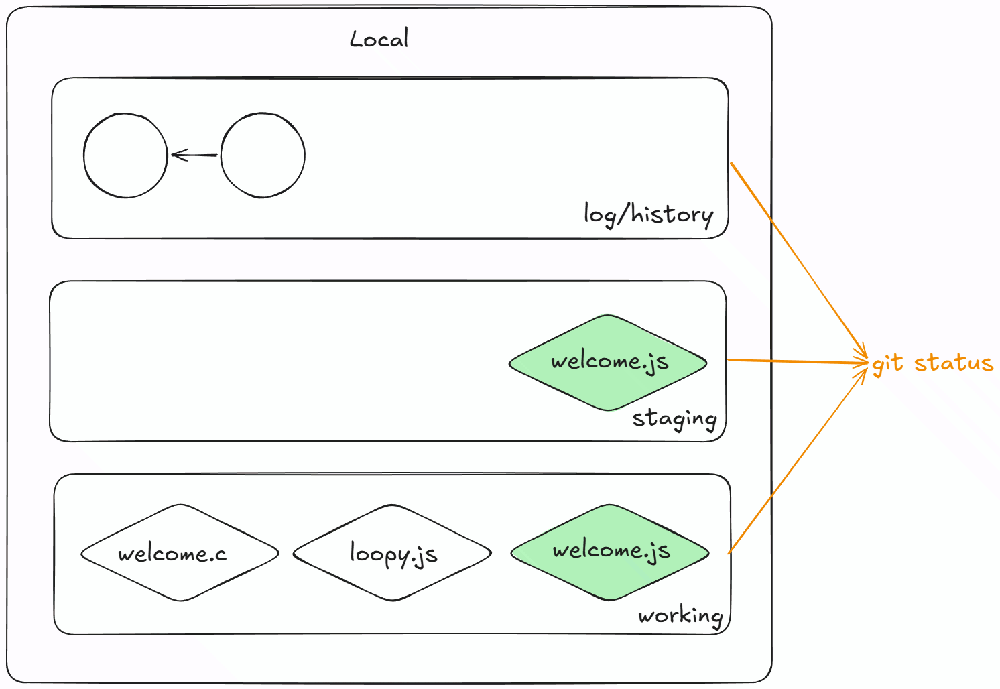
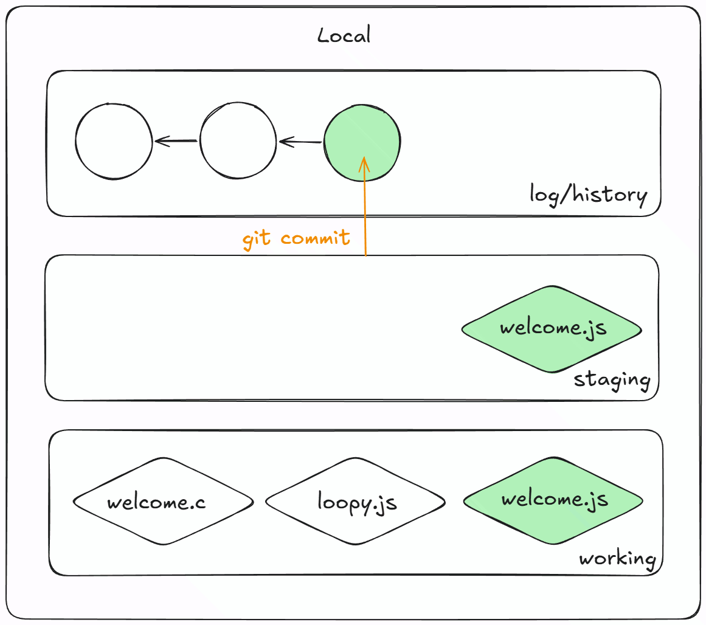
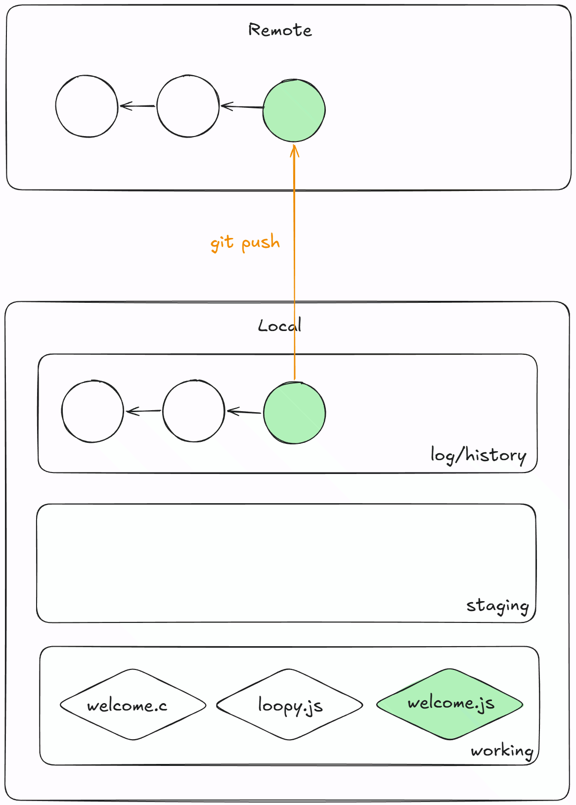
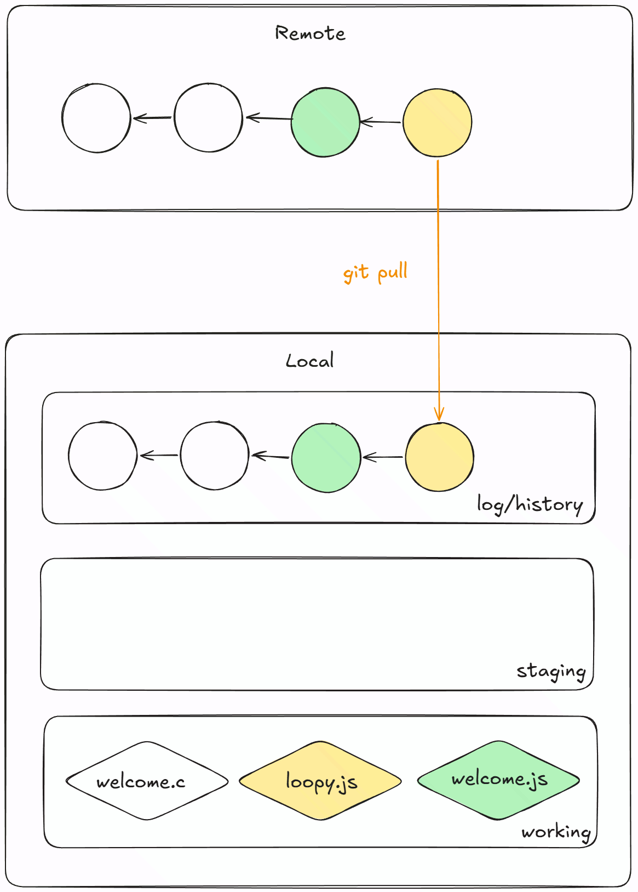

# Tutorial 1

[TOC]

> **[TUTOR NOTE]** Please fork this repository before coding!
>
> Although the introduction activity is gone, please introduce yourself to your
> class and get keen to meet them individually during the labs.
>
> Tutors may wish to start with git e.g.
> - `git clone` the forked repository
> - complete the JS activity
> - `git status` `git add` `git commit` `git push` the changed files

## A. Javascript

> 25 minutes

### 1. Basic Syntax, Input/Output, Conditionals & Control Flow + Functions

Consider the C program in the file [welcome.c](welcome.c). In this repository, there is another file called [welcome.js](welcome.js). In this file, convert the C program above into a JavaScript program.

> <details close>
> <summary> Click to view SOLUTION! </summary>
>
> ```js
> // No #include
> // no main function
> const SIZE = 10; // Dynamically typed & const
>
> const message = 'Welcome to COMP1531!'; // Single quotes
> console.log(message); // No '\n'
>
> console.log(`Numbers from 1 to ${SIZE}`); // Recommended string layout
> for (let num = 1; num <= SIZE; num++) { // let
>     print_parity(num);
> }
>
> function print_parity(num) { // function & no type in parameter & no return type
>     if (num % 2 === 0) { // Triple equals
>         console.log(`EVEN: ${num}`);
>     } else {
>         console.log(`ODD: ${num}`);
>     }
> }
> ```
>
> </details>

As you write the program, discuss the following questions:
- Why don't we need to specify the type of a variable when we declare it?
    > JavaScript is *dynamically typed* - the interpreter (node) will figure out at runtime what the type of the variable is.

- What are `const` and `let`?
    > - `const`: for declaring constants, cannot be reassigned
    > - `let`  : for declaring variables, can be reassigned

- How is JavaScript's `console.log` function different to `printf` in C?
    > - It will print a '\n' automatically
    > - does not need to be imported (printf requires `<stdio.h>`)

- How can we format strings?
    > - template literals: with backticks `` and ${variable} where the value of the variable should be placed
    > - concatenating: many ways to do this, common ways are with + or , (eg: `console.log("hello " + "world!")` or `console.log("hello", "world!")`)

- What does `2 == '2'` return? why?
    > returns true as it converts the string to a number before comparing. for strict comparisons, use `===`

- Why don't JavaScript programs need a `main` function?
    > JavaScript programs are interpreted line-by-line, whereas the point of execution for C programs is the `main` function.

- How do we create a function? how is this different to creating functions in c?
    > - by using the `function` keyword then providing the name of the function!
    > - we don't need a function prototype, return type or parameter types when declaring a function

### 2. Arrays, Objects, and Loops
Javascript objects are just a collection of properties, kinda like structs, but better. Properties are key value pairs in the form `key: value` where keys are strings and values can be of any type (String, Number, Array, Object, etc..).

```js
let fruit = {
    name: 'apple',
    cost: 2
}
```

1. How can we get the name and cost of the fruit in the object above?
    > `fruit.name` and `fruit.cost`

2. Brainstorm ways we can loop through the shopping list given in [loopy.js](loopy.js) to print the names of all items in the shopping list?

    > <details close>
    > <summary> Click to view SOLUTION! </summary>
    >
    > ```js
    > // 1. c-style for loop (not recommended)
    > for (let i = 0; i < shoppingList.length; i++) {
    >     console.log(shoppingList[i].name);
    > }
    >
    > // 2. for in loop (not recommended for this)
    > for (const i in shoppingList) {
    >     console.log(shoppingList[i].name);
    > }
    >
    > // 3. for of loop (recommended)
    > for (const item of shoppingList) {
    >     console.log(item.name);
    > }
    > ```
    >
    > </details>

3. Why should we use for of loops instead of for in loops where possible? <br> (`typeof` is a function that returns a string with the type of the argument passed in. what does this program output?)

    ```js
    const arr = [1, 2, 3]
    for (const i in arr) {
        console.log(typeof(i))
    }
    ```

    > - for of loops often produce cleaner code as we don't need extra code to index the array
    > - the code above will print "string" 3 times indicating that i is not a number, but a string. this can cause issues when trying to perform arithmetic on the index, notably with the `+` operator as `'1' + 1 = 11` in javascript
    > - note: sometimes you may need to use the index and a `for in` loop would be needed.

4. [ADVANCED] We often need to perform common operations when working with arrays... JS has inbuilt array methods that can help us! Pick 1 or 2 loops in [methods.js](methods.js) to rewrite with array methods.

    > **[TUTOR NOTE] Students may be overwhelmed here, so please reassure them that they don't need to understand these yet. For now, this is a stylish method for advanced students to explore.**

    You may find the following webpage useful: https://developer.mozilla.org/en-US/docs/Web/JavaScript/Reference/Global_Objects/Array

    > <details close>
    > <summary> Click to view SOLUTION! </summary>
    >
    > ```js
    > // 1. Check if an array of numbers contains 67
    > const numbers = [ 42, 789, 67, 0, 1 ];
    > const present = numbers.includes(67);
    >
    > // 2. Filter only words containing `cat` from a list
    > const words = [ 'locate', 'turtle', 'educational', 'copy' ];
    > const catWords = words.filter(w => w.includes('cat'));
    >
    > // 3. Triple all prime numbers
    > const primes = [ 2, 3, 5, 7, 11 ];
    > const triplePrime = primes.map(p => p * 3);
    >
    > // 4. Find the first game that has name 'Exploding Kittens'
    > const games = [
    >   { name: 'Chess', players: [2] },
    >   { name: 'Valorant', players: [1,5] },
    >   { name: 'Exploding Kittens', players: [2,5] },
    >   { name: 'Roblox', players: [1, undefined] },
    > ];
    > const foundKittens = games.find(g => g.name === 'Exploding Kittens');
    > ```
    >
    > </details>

## B. Git Fundamentals

> 15 minutes

For many of you, this tutorial happens before you've seen the `git` content in lectures! This is by design, as the basics of git are quite straightforward and procedural. We will go into more depth in the future.

However, for right now, it's only important to know that `git` is a command line tool that helps you "save" your work on the cloud and makes it easier to collaborate with others. Right now we're going to focus on getting and saving our work with git.

> **[TUTOR NOTE]**
> - please clone this repo or make another blank repo when doing this activity
> - after each command, make sure to explain the state of the repo.

1. To get the files from the remote repo (cloud) to your computer, run
    ```
    $ git clone [ssh link here]
    ```
    > this is like "copying"/"downloading" the repo in gitlab to your device.
    <details close>
    <summary> Diagram</summary>

    
    </details>
2. To check the status of your local repo, run
    ```
    $ git status
    ```
    > we haven't made any changes, so there's nothing to commit (save)
    <details close>
    <summary> Diagram</summary>

    
    </details>
3. Add your welcome.js code into the repo and run
    ```
    $ git status
    ```
    > the file we just made is untracked! we can think of this as "not saved" to the local repo yet
    <details close>
    <summary> Diagram</summary>

    
    </details>
4. Add the file to the staging area
    ```
    $ git add welcome.js
    ```
    > let's add the file to the staging area. the staging area is good for putting all the files you want to "save" together.

    <details close>
    <summary> Diagram</summary>

    
    </details>
5. Run
    ```
    $ git status
    ```
    > we can see what's in our staging area to be committed
    <details close>
    <summary> Diagram</summary>

    
    </details>
6. Commit files! remember to add a commit message
    ```
    $ git commit -m "finished welcome.js"
    ```
    > this is like taking a snapshot of the files in the staging area and saving the state of them. <br> Remind students that they should get into the habit of writing descriptive commit messages now as they will be assessed on them later.
    <details close>
    <summary> Diagram</summary>

    
    </details>
7. Run
    ```
    $ git status
    ```
    > branch is ahead of origin/master by 1 commit: we have made a commit on our local repo that isn't on our remote repo
8. Push!
    ```
    $ git push
    ```
    > this is how we get code up into the remote repo. the commits we made get pushed up and updated in the remote
    <details close>
    <summary> Diagram</summary>

    
    </details>

Sometimes your remote repo may have some changes that aren't in your local repo (we may update lab activities). So how do we get changes from your remote repo into your local repo?
> `git pull`

<details close>
<summary> Diagram</summary>


</details>

> **[TUTOR NOTE]** Remind students that git is complicated and it's ok if they don't get it right away. Also encourage them to do lab01_git after following the getting started guide during lab time before all other labs.

## Further Resources

- In addition to labs, there are smaller-scale "Practice Activities" that can be accessed on the Course Website and Gitlab. These are not worth any marks as the solutions have already been provided, although they can serve as a nice warmup for the labs.
- If you find yourself struggling to keep up with the course content, there are also NodeJS online courses available to help you build up your fundamentals, such as:
    - https://liveclasses.nodejsacademy.com/store/NodeJS-Introductory-Course-5boa5ezar0v9
    - https://www.codecademy.com/courses/learn-node-js/articles/welcome-to-learn-node-js
    - https://git-scm.com/book/en/v2/Getting-Started-What-is-Git%3F
