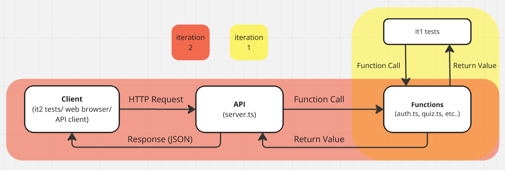

# Tutorial 4

[TOC]

> tutor note: Main focus for this week is typescript and intro to http servers. Show students lint-fix and tell them that some style errors need to be manually fixed if running short for time

## A. Intro to Typescript & Types

> 15 minutes

1. Open [package.json](./a.typescript/package.json) and look through `"scripts"`,  `"dependencies"` and `devDependencies` (if they exist). Install the packages if not already.
    > ```shell
    > $ npm install
    > ```

    > NOTE:<br/>
    > tsx is similar to node - it allows us to execute *.ts files directly
    > (without having to 'compile' them into javascript using 'tsc')
    >
    > tsc has been added as a script in [package.json](./a.typescript/package.json) with the noEmit flag.
    > This means it won't produce an output file when run. We can use it as a type checker instead.

In [types.js](a.typescript/types.js) lies some basic functions:

### Interface: Functions
<table>
  	<tr>
    	<th>Name & Description</th>
    	<th>Parameters</th>
    	<th>Return Type</th>
    	<th>Errors</th>
  	</tr>
  	<tr>
    	<td>
    	    <code>sum</code><br>
    	    Given 2 numbers, return the sum.
    	</td>
    	<td>
    	    (num1: <code>number</code>, num2: <code>number</code>)
    	</td>
    	<td>
    	    <code>number</code>
    	</td>
    	<td>
    	    N/A
    	</td>
  	</tr>
  	<tr>
    	<td>
    	    <code>isEven</code><br>
    	    Given a number, return true if it's even and false if it's odd.
    	</td>
    	<td>
    	    (num: <code>number</code>)
    	</td>
    	<td>
    	    <code>boolean</code>
    	</td>
    	<td>
    	    N/A
    	</td>
  	</tr>
  	<tr>
    	<td>
    	    <code>sumArray</code><br/>
    	    Given an array of numbers, return the sum of all numbers in the array.
    	</td>
    	<td>
    	    (numbers: <code>number[]</code>)
    	</td>
    	<td>
    	    <code>number</code>
    	</td>
    	<td>
    	    N/A
    	</td>
  	</tr>
  	<tr>
    	<td>
    	    <code>createUser</code><br/><br/>
    	    Given an email and a name, create a user object and return an userId for that user.
    	</td>
    	<td>
    	    (email: <code>string</code>, name: <code>string</code>)
    	</td>
    	<td>
    	    <code>UserId</code>
    	</td>
    	<td>
    	    <code>Error</code> if email or name is an empty string, representing errors with <code>INVALID_DETAILS</code>.
    	</td>
  	</tr>
  	<tr>
    	<td>
    	    <code>getUser</code><br/><br/>
    	    Given an userId, return information about a user.
    	</td>
    	<td>
    	    (userId: <code>number</code>)
    	</td>
    	<td>
    	    <code>UserInfo</code>
    	</td>
    	<td>
    	    <code>Error</code> if userId does not correspond to an existing user, representing errors with <code>UNAUTHORISED</code>.
    	</td>
  	</tr>
</table>

### Interface: Data Types
<table>
  <tr>
    <th>Interface</th>
    <th>Structure</th>
  </tr>
  <tr>
    <td>
        <code>UserId</code>
    </td>
    <td>
        Object containing key
<pre>{
    userId: number,
}</pre>
    </td>
  </tr>
  <tr>
    <td>
        <code>UserInfo</code>
    </td>
    <td>
        Object containing keys
<pre>{
    userId: number,
    name: string,
    email: string,
}</pre>
    </td>
  </tr>
  <tr>
    <td>
        <code>Error</code>
    </td>
    <td>
        Object containing key
<pre>{
    error: string,
    message: string
}</pre>
    </td>
  </tr>
</table>

### Task

1. At the bottom of [types.js](a.typescript/types.js),
    - what will happen if these functions were supplied with invalid (e.g. wrong type), missing or extra arguments?
    > It can lead to unexpected behavior that can break your program.
    - run the program with:
        ```shell
        $ node types.js
        ```
        Discuss the results

2. Rename the `types.js` file to `types.ts` and add type annotations to the functions, constants and variables as needed. Create interfaces as needed for more complex types.

    > solution in [types.ts](./a.typescript/solutions/types.ts) and [interface.ts](./a.typescript/solutions/interface.ts)

    i) After adding type annotations, why does our program still error at  this line of code? <br>
    ```js
    let user1 = createUser('valid@email.com', 'user1');
    console.log(user1);
    console.log(getUser(user1.userId));
                          //  ^ Property 'userId' does not exist on type 'UserId | Error'.
    ```
    > The return type of `createUser` can be `Error` or `UserId`. Since `userId` only exists on `UserId`, we need to typecast it so that typescript doesn't think we're trying to access `userId` on an `Error` object.
    > ```js
    > let user1 = createUser('valid@email.com', 'user1') as UserId;
    > ```

3. What will happen to the invalid console.log statements now when we attempt to compile the program using `tsc` or execute it with `tsx`
    ```shell
    $ npm run tsc types.ts
    $ npm run tsx types.ts
    ```
    > running `npm run tsc types.ts` will result in type errors as we're passing incorrect types to the functions.
    > running `npm run tsx types.ts` will run the code despite the type mismatches as it does not type check.

4. (Optional) Remove function return types and re-execute/compile your code. Discuss your observations.
    > Your code will run or compile without errors as typescript can infer return types from functions. It is still good practice to specify the return types of functions though as it can help to pick up errors + autocomplete

5. (Optional) Why do we need to type the constant `users` but not `id`?
    > The type of `id` can be inferred from the value assigned to it, but the type of `users` can't as typescript doesn't know what type of objects will eventually be stored in that array without explicit typing.

5. (Optional) Rewrite the UserInfo interface so that it extends the UserId interface. Why would we want to do this?
    > It reduces repetition in interfaces, resulting in fewer areas to update if you modify a property shared across multiple interfaces and cleaner code.

5. (Optional) What would be a better way to type the error type string so that you can't ever make spelling mistakes or return an error type that doesn't exist?
    > Instead of relying on the `string` type, you can make your own type. For example `ErrorType` which can either be `UNAUTHORISED` or `INVALID_DETAILS` (through either an enum or a union type).

## B. APIs

> 5 minutes

- What is an API?
> - Application Programming Interface
> - A mechanism that enables two or more software components to communicate or interact with each other using a set of definitions and protocols.
>   - Basically, a way for computer programs to talk to each other.

Below are some examples of real-world APIs that are publicly available for everyone to use!
  - [🎼 Spotify](https://developer.spotify.com/documentation/web-api/reference/#/)
    - and a cool [example](https://everynoise.com/) of how the Spotify API can be used in a project
  - [💰 Stocks/Finance](https://finnhub.io/docs/api/introduction)
  - [🦎 Pokemon](https://pokeapi.co/)

For a more comprehensive list of free APIs for use in software and web development, see:
- https://github.com/public-apis/public-apis

You will be building an API based on the swagger.yaml file in your project repository!

## C. HTTP Servers
> 20 minutes

We deploy our APIs on HTTP servers which can process HTTP requests and responses.


### Requests

1. What information might we need in a HTTP request?
    > \- URL (Base URL + Path) <br>
    > \- HTTP method (PUT/POST/GET/DELETE) <br>
    > \- Parameters (query/path/body)

2. Which HTTP method would we use for each of these functions:

    1. adminAuthRegister
    2. adminUserDetails
    3. adminUserPasswordUpdate
    4. adminQuizList
    5. adminQuizCreate
    6. adminQuizRemove
    7. adminQuizNameUpdate
    8. clear

    >  1\. Post 2. Get 3. Put 4. Get 5. Post 6. Delete 7. Put 8. Delete

3. What types of HTTP request do we use query parameters, path parameters, and/or request bodies?

    > \- Query: In GET and DELETE requests to filter or sort data <br>
    > \- Path: In all requests to identify a specific resource. <br>
    > \- Body: In PUT and POST requests to send data to the server.

### Responses

1. What information might we get in a HTTP response?

    > \- Body (JSON string) <br>
    > \- Status Code (200/400/401/403 + 404/500)

2. What does each of the below status code mean or tell you about the state of the request?
    1. 200
    2. 400
    3. 401
    4. 403
    5. 404
    6. 500
    > 1. OK (request was successful)
    > 2. BAD REQUEST (request was constructed incorrectly / invalid request syntax)
    > 3. UNAUTHORIZED (user is unauthenticated)
    > 4. FORBIDDEN (user doesn't have access rights to the content)
    > 5. NOT FOUND (requested resource cannot be found, could arise from sending requests with an incorrect path)
    > 6. SERVER ERROR (you probably messed up a function implementation or a route)

### Sending Requests

1. How can we send HTTP requests?
    > - Web browser (GET only)
    > - HTTP Clients eg: Thunder Client, Postman, ARC etc...
    > - Libraries eg: curl, sync request curl

2. In an API client, create valid and invalid requests to one of the APIs given above (eg: send a GET request to https://pokeapi.co/api/v2/pokemon/ditto). After each request, take a look at the response body and status codes.

## D. Linting
> 10 minutes

> tutor note: just show students how to use lint-fix if you're running out of time, don't worry about fixing the code manually.

Below is a piece of software written by a COMP1531 tutor back when they were still a newbie programmer in COMP1511. This was the interface that they followed:

### Interface: Functions

<table>
  <tr>
    <th>Name & Description</th>
    <th>Parameters</th>
    <th>Return Type</th>
    <th>Error</th>
  </tr>
  <tr>
    <td>
        <code>drawX</code><br/><br/>
        Return a string that contains an x of a certain size, made up of smaller x-es.<br/>
        There should be no trailing white spaces.
    <td>
        (size)
    </td>
    <td>
        <code>string</code>
    </td>
    <td>
        Return the string <code>'error'</code> if the given <code>size</code> is not an odd number.
    </td>
  </tr>
</table>

1. Without modifying the code, review the `drawX` function in [x.ts](d.linting/x.ts), what are some styling/design issues?
    > Answers may vary - here are a few:
    > - 4-indent (prefer 2 in COMP1531)
    > - else-if and else *after* return (debatable)
    > - missing semi-colons
    > - poor variable names
    > - redundant variables (e.g. `k`, `l`)
    > - `for` loop is preferred when there is a fixed number of iterations
    > - should check for even `size` at the beginning.
    > - using `==` instead of `===`
    > - not type-annotated!

1. Open `package.json` and look through `scripts`,  `dependencies` and `devDependencies`. Install them if not already!
    > ```shell
    > $ npm install
    > ```

1. Use `eslint` to identify any linting issues.
    > Can also show in IDE, but also show in command line
    > ```shell
    > $ npm run lint x.ts
    > ```

1. Use `eslint` to auto-fix most issues.
    > Can do in IDE, but undo and show in command line
    > ```shell
    > $ npm run lint-fix x.ts
    > ```

1. Fix any remaining issues manually and refactor the code if applicable.

    >
    > <details close>
    >
    > <summary>Solution</summary>
    >
    > ```js
    > export function drawX(size: number) {
    >   if (size % 2 === 0) {
    >     return 'error';
    >   }
    >   let result = '';
    >   for (let row = 0; row < size; row++) {
    >     for (let col = 0; col < size; col++) {
    >       if (col === row || col === size - row - 1) {
    >         result += 'x';
    >       } else {
    >         result += ' ';
    >       }
    >     }
    >     result = result.trim() + '\n';
    >   }
    >   return result.slice(0, -1);
    > }
    > ```
    >
    > </details>
