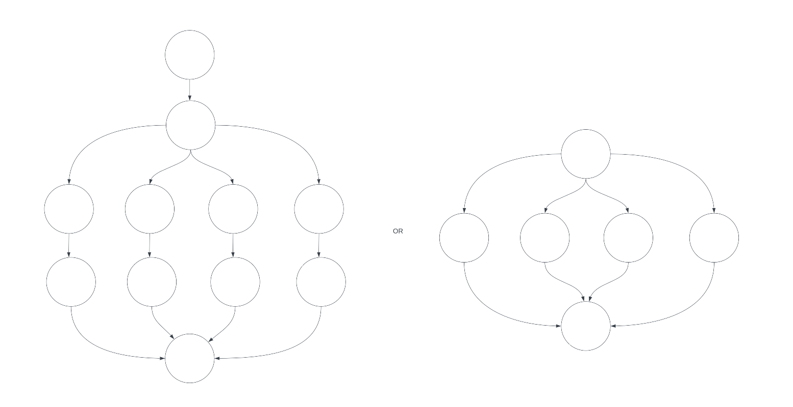
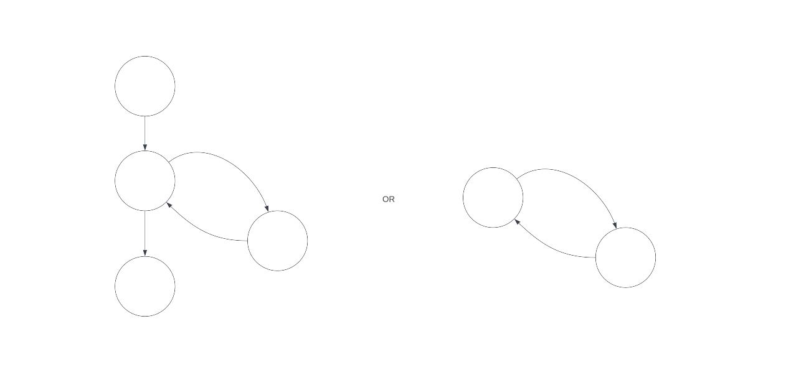
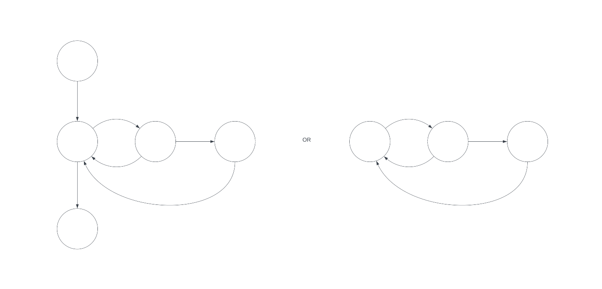

# Tutorial 9

[TOC]

## A. Complexity Analysis

> 20 minutes

Below are solutions to `lab01_leap`. In groups of 2-3, draw a control flow graph
for the code shown on the screen  and calculate the resulting cyclomatic
complexity.
  > For this activity, make sure that student are attempting this in groups of
  > 2-3 (and not as a group of 5). Show the functions 1 at a time, give students
  > 3-4 minutes to draw the graph and calculate the complexity, then discuss
  > what the solution should be

1. `isLeap`:
    ```ts
    const isLeap = (year: number) => {
      let result: boolean;
      if (year % 4 !== 0) {
        result = false;
      } else if (year % 100 !== 0) {
        result = true;
      } else if (year % 400 !== 0) {
        result = false;
      } else {
        result = true;
      }
      return result;
    };
    ```
    > <details close>
    > <summary>view diagram</summary>
    >
    > 
    >
    > </details>
    >
    > C = 4

1. `getNextLeap`:
    ```ts
    const getNextLeap = (year: number) => {
      let nextLeap = year + 1;
      while (!isLeap(nextLeap)) {
        nextLeap++;
      }
      return nextLeap;
    };
    ```
    > <details close>
    > <summary>view diagram</summary>
    >
    > 
    >
    > </details>
    >
    > C = 2

1. `countLeaps`:
    ```ts
    const countLeaps = (yearArray: number[]) => {
      let count = 0;
      for (const year of yearArray) {
        if (isLeap(year)) {
          count++;
        }
      }
      return count;
    };
    ```
    > <details close>
    > <summary>view diagram</summary>
    >
    > 
    >
    > </details>
    >
    > C = 3


## B. Requirements Analysis

> 30 minutes

### Part 1: Functional vs Non-Functional

- What is the difference between functional and non-functional requirements?
    > **Functional requirements**
    > - specify a specific capability/service that the system should provide.
    > - it's *what* the system does.
    >
    > **Non-functional requirements**
    > - place a constraint on *how* the system can achieve this.
    > - typically this is a performance, reliability, or usability characteristic.

- Are the following requirements functional or non-functional?

  1. The messaging system shall let users upload profile pictures.
      > Functional

  2. The maximum image upload size shall be 5 MB.
      > Non-functional

  3. The website should be able to handle 20 million users with a latency (response time) smaller than 0.5 seconds.
      > Non-functional

  4. The default background colour for chat windows will be blue and have a hexadecimal RGB colour value of 0x0000FF.
      > Non-functional

  5. The software should be portable. So moving from one Operating System (OS) to another will not create any problems.
      > Non-functional

  6. The system shall send password reset emails.
      > Functional

### Part 2: Good Requirements

Your tutor will break you up into random groups to complete this activity. Answer the questions below:

1. What are some attributes of good requirements?
    > Answers will vary. Here are a few:
    > - clear (unambiguous) (understandable)
    > - concise (specific)
    > - atomic (independent)
    > - verifiable (testable)
    > - attainable (feasible, possible to be reasonbly achieved)
    > - abstract (not reliant on specific implementation details)

1. Consider the text below:
    ```
    I want a burger with lots of pickles and mayo but I need to make sure that the mayo doesn't make the burger bun really wet.
    Oh, and it needs to be warm, like, made less than 5 minutes ago warm but not so hot that I burn myself. I'm also not a big fan of plastic containers so if it could be in a paper bag that would be good. Actually, make that a brown paper bag, I like the colour of that. Also also, I hate it when my hands get oily so could you please give me something to wipe them with after.
    ```
    How could we clean this up into well-described requirements, from
    1. The Maccas customer to the staff taking the order
        > A burger with
        > - lots of pickle
        > - lots of mayo
        > - non-soggy buns
        > - warm temperature (not hot enough to burn)
        > - brown paper bag packaging
        > - napkins

    1. The staff taking the order to the kitchen
        > A burger with
        > - 10 pickles
        > - 50 ml mayo
        > - freshly toasted bun (relative humidity 70%)
        > - 50 degrees Celcius
        > - brown paper bag packaging
        > - 2 napkins

### Part 3: User Stories

Consider the some requirements of Unigotchi:

Ability to:
1. Register, login and log out
1. Create, view and modify universes
1. Create a simulation, view and list simulation details
1. Inside a simulation, take different simulation actions within restrictions
1. ...

Pick **one** of the above and write a series of user stories that encompass each requirement:

1. Discuss as a class the potential target audience, and use this as your type of user;
* Write acceptance criteria for each story and discuss when to use Scenario-based and Rule-based acceptance criteria

> For example:
>   (3) Create a simulation, view and list simulation details.
>
>   As a UNSW student, I want to be able to create a simulation, to take actions and see the results.
>   - A student can create a universe by passing in valid universe JSON data
>   - A student can create a universe by passing in valid universe JS Object
>   - Given universe data is invalid, the system should reject creating a simulation, and a descriptive error should be reported.
>   - After a student creates a simulation, it shall appear in their list and detailed views.
>
>   As a UNSW student, I want to view details of my simulation, to understand the impact of my actions and see modifications.
>   - A student can view the details of their own created simulation, but not of others.
>   - Given a valid actions impacts a simulation, when viewed, then the updated stats (energy, happiness) should immediately display.
>   - The simulation display should include it's
>       - simulationStatus
>       - currentActivity
>       - energy
>       - happiness
>       - timeElapsed
>
>   As a UNSW student, I want to see a list of my simulations, to track my creations and understand their progress.
>   - Given a student is logged in, when they view their list, then all their created simulations should be displayed, but not of others.
>   - The simulation display should include it's simulationId
>   - The simulation display should include it's simulationStatus
>   - The simulation display should include it's createdAt time

### Part 4: Use Cases

Pick **one** of the above requirements you have written stories for and write a use case for the flow of interaction.

> Use Case: View a Simulation
> - Goal in context: A student can view a simulation they have created i.e. are the owner of.
> - Scope: Unigotchi
> - Level: Primary Task
> - Preconditions: The student has registered an account and is logged in.
> - Success End Condition: The student is authorised to see the details of a simulation.
> - Failed End Condition: The student is unauthorised and cannot see the details of a simulation.
> - Primary Actor: Student
> - Trigger: Student selects view button on simulation.
>
> Success Scenario 1
> 1. Student creates a simulation.
> 1. Student selects view button on simulation.
> 1. Student is authorised to see simulation details.

